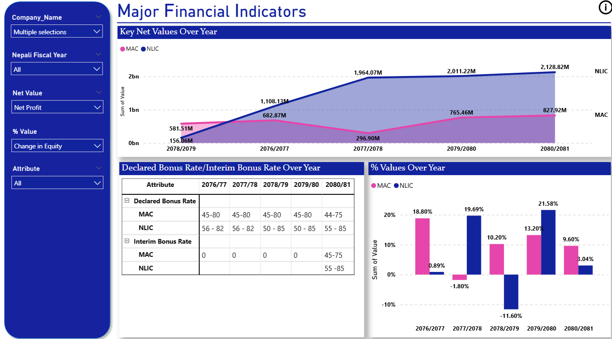
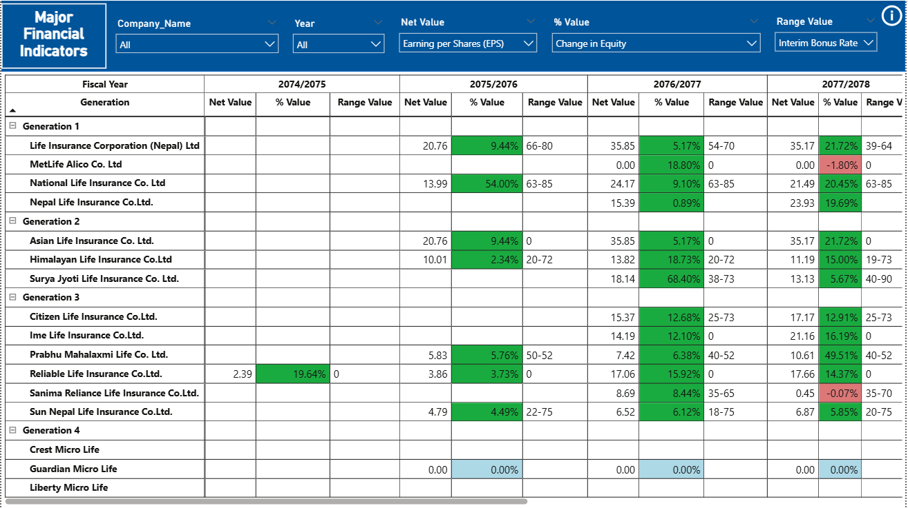
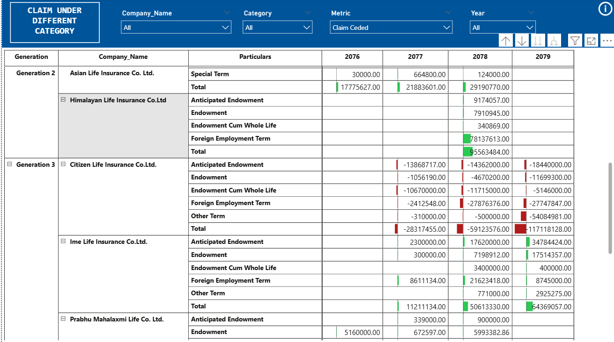
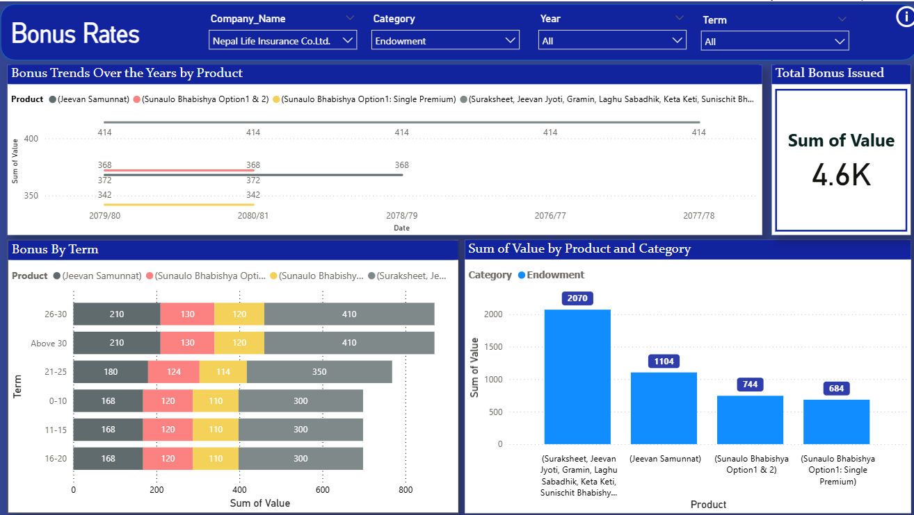
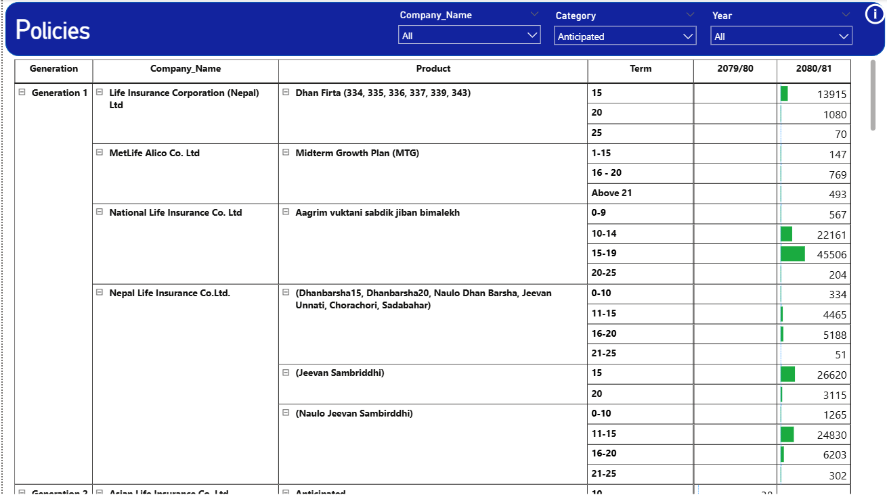
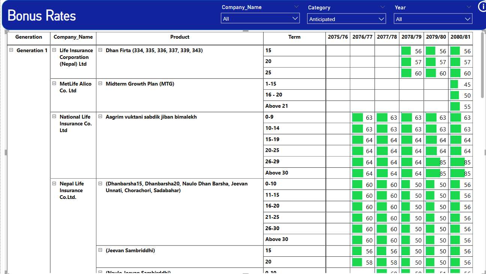
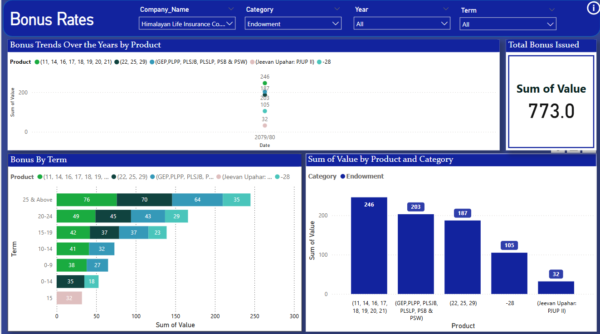
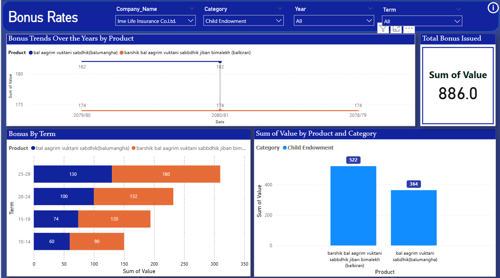
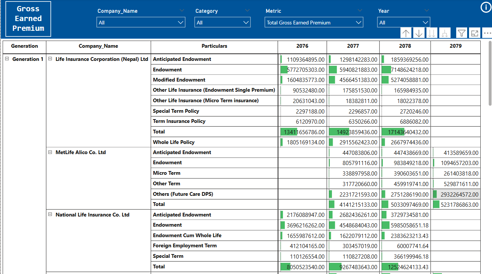
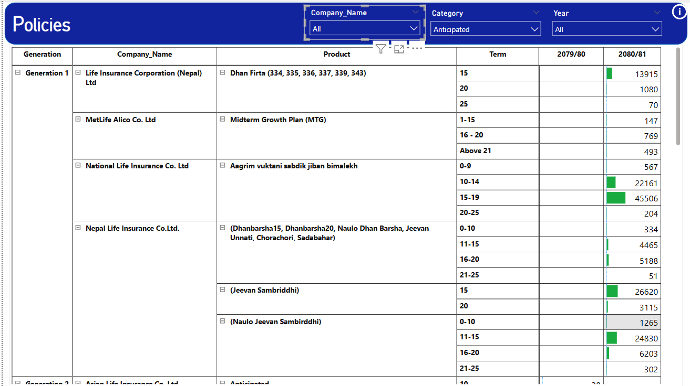

This project analyses the four generations of Insurance Companies under different categories. It aims to uncover industry trends of insurance companies over the past 5 years.
# Project Images

  
  
  

  
  
  

  
  
  

  
  

**Objectives**

Analyse the major financial indicators under 57 different categories and the performance of insurance companies. (Past 5 years Data)
Analyse the Claim Under Different Categories (Past 5 years Data)
Analyse Gross Earned Premiums (Past 5 years Data)
Analyse Bonus Rates (Past 5 years Data)
Analyse the number of Policies (Past 5 years Data)
Visualise all the above data.

Compare different insurance companies based on various factors.

Identify potential growth opportunities in the Nepalese insurance sector.

Tools & Technologies Power BI – For data visualisation and dashboard creation. SQL - For data collection and cleaning. Excel/CSV – Data collection and preprocessing.

Data Sources Publicly available reports of insurance companies. Government and regulatory body datasets. Market research and surveys.

** Visualizations & Insights** Company-wise premium and claim trends. Market Share Distribution among Life Insurance Companies. Growth analysis over time.

🚀 Future Enhancements Integrating additional datasets for deeper analysis.

Expanding analysis to include non-life insurance companies.

Automating data updates using APIs.
